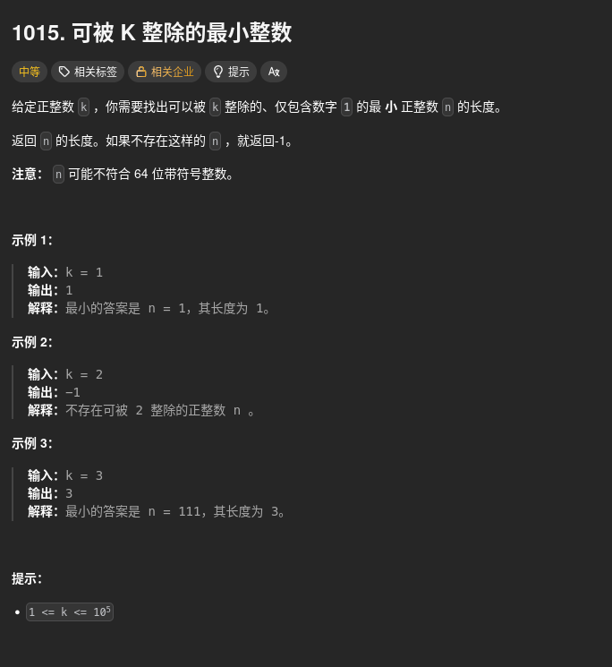

##### 題目：[1015. Smallest Integer Divisible by K](https://leetcode.com/problems/smallest-integer-divisible-by-k/)

<!-- more -->



##### 方法一：模運算
**題意**：
給一正整數 k, 找出最小的能夠被 k 整除, 且只包含數字 1 的正整數 n 的長度

**思路**：
1. 若 k 可被 2 或 5 整除(尾數為 0、2、4、5、6、8)，則不符合題目要求，直接回傳 -1 (因為任何只包含數字 1 的數字都不可能是偶數或 5 的倍數)
2. 使用迴圈從長度 1 開始計算只包含數字 1 的數字對 k 的餘數  (1 = 10^0 + 1, 11 = 10^1 + (10^0 + 1), 111 = 10^2 + (10^1 + (10^0 + 1)) ...)
3. 每次迴圈中，更新餘數為 (前一次餘數 * 10 + 1) % k
4. 若餘數為 0，表示找到了符合條件的長度，回傳該長度
5. 若迴圈結束後仍未找到符合條件的長度，回傳 -1  (理論上不會到這一步，因為餘數最多有 k 種可能)

```cpp
class Solution {
public:
    int smallestRepunitDivByK(int k) {
        // 若 k 可被 2 或 5 整除(尾數為 0、2、4、5、6、8)，則不符合題目
        // e.g. 111 % 8 = 7, 111 % 10 = 1
        if (k % 2 == 0 || k % 5 == 0) return -1;

        int remainder = 0; // 餘數
        for (int length = 1; length <= k; ++length) {
            remainder = (remainder * 10 + 1) % k; // 計算新的餘數
            if (remainder == 0) return length; // 找到符合條件的長度
        }

        return -1;
    }
};
```