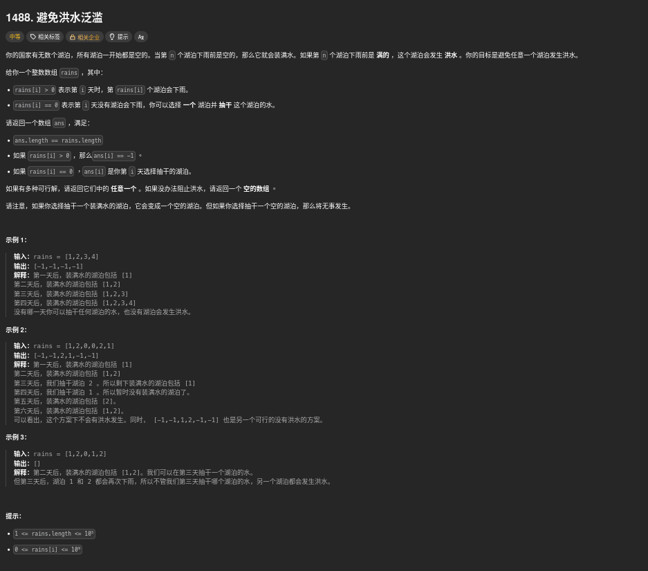

##### 題目：[1488. Avoid Flood in The City](https://leetcode.com/problems/avoid-flood-in-the-city/)

<!-- more -->



##### 方法一：貪心

貪心：優先抽即將要下雨，而且有水的湖泊
但是在不下雨的時候選擇抽哪個湖泊需要遍歷有水的湖泊，太費時間
於是在下雨時決定要不要在過去不下雨的某一天抽乾這個湖泊
因為 rains 是按日期升序的，因此這樣的做法符合優先抽即將要下雨的湖泊的策略

```cpp
class Solution {
public:
    vector<int> avoidFlood(vector<int>& rains) {
        vector<int> result(rains.size(), -1);
        set<int> dryDays;   // 記錄不下雨日期的索引
        unordered_map<int, int> lastRain;   // 記錄湖泊及其上次下雨的日期

        for (int i = 0; i < rains.size(); i++) {
            if (rains[i] == 0) {
                // 不下雨的日子
                dryDays.insert(i);
                result[i] = 1; // 暫時設為1，後續可能會更改
            } else {
                // 下雨的日子
                int lake = rains[i];
                
                // 如果湖泊已有水，需要找空閒日抽水
                if (lastRain.find(lake) != lastRain.end()) {
                    // 找到上次該湖泊下雨後的第一個空閒日
                    auto it = dryDays.upper_bound(lastRain[lake]);
                    
                    if (it != dryDays.end()) {
                        result[*it] = lake;  // 在該空閒日抽這個湖泊的水
                        dryDays.erase(it);
                    } else {
                        return {};  // 無法避免洪水
                    }
                }
                
                // 更新湖泊的下雨日期
                lastRain[lake] = i;
            }
        }
        return result;
    }
};
```