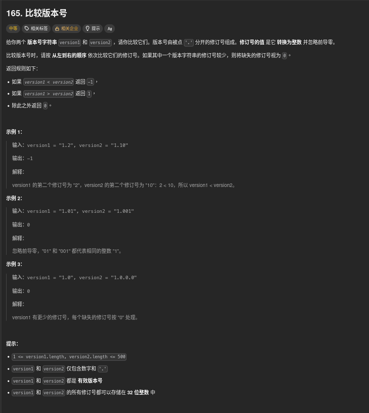

##### 題目：[165. Compare Version Numbers](https://leetcode.com/problems/compare-version-numbers/)

<!-- more -->



##### 方法一：vector 分割法 (字串分割)

將 `version1` 和 `version2` 以 `.` 分割成多個子版本號，將每個分割出的 item 忽略前導零後轉換成整數，然後逐一比較對應位置的子版本號大小。

**方法**：
1. 使用 `stringstream` 和 `getline` 函數以 `.` 為分隔符將版本號字串分割成多個子版本號，並存入兩個整數向量 `v1` 和 `v2`。
2. 計算兩個向量的最大長度 `n`，然後從 `0` 到 `n-1` 逐一比較對應位置的子版本號：
   - 如果 `v1` 在該位置沒有對應的子版本號，則視為 `0`。
   - 如果 `v2` 在該位置沒有對應的子版本號，則視為 `0`。
   - 比較兩個子版本號的大小，若 `v1[i] < v2[i]` 返回 `-1`，若 `v1[i] > v2[i]` 返回 `1`。
3. 如果所有對應位置的子版本號都相等，則返回 `0`。

```cpp
class Solution {
public:
    int compareVersion(string version1, string version2) {
        vector<int> v1, v2;
        stringstream ss1(version1), ss2(version2);
        string item;

        // 分割 version1
        while (getline(ss1, item, ".")) {
            v1.push_back(stoi(item));   // 忽略前導零並轉換成整數
        }

        // 分割 version2
        while (getline(ss2, item, ".")) {
            v2.push_back(stoi(item));   // 忽略前導零並轉換成整數
        }

        int n = max(v1.size(), v2.size());
        for (int i = 0; i < n; ++i) {
            int num1 = (i < v1.size()) ? v1[i] : 0; // 如果 v1 沒有對應位置，則視為 0
            int num2 = (i < v2.size()) ? v2[i] : 0; // 如果 v2 沒有對應位置，則視為 0

            if (num1 < num2) return -1;
            if (num1 > num2) return 1;
        }
        return 0; // 所有子版本號都相等
    }
};
```

<br>

##### 方法二：指標遍歷 (雙指標)

**方法**：
1. 使用兩個指標 `i` 和 `j` 分別遍歷 `version1` 和 `version2`。
2. 在每次迴圈中，分別從 `i` 和 `j` 開始提取子版本號，直到遇到 `.` 或字串結尾為止，並將提取出的子版本號轉換成整數 `num1` 和 `num2`。
3. 比較 `num1` 和 `num2` 的大小，若 `num1 < num2` 返回 `-1`，若 `num1 > num2` 返回 `1`。
4. 如果兩個子版本號相等，則繼續下一輪迴圈，直到兩個字串都遍歷完。
5. 如果所有對應位置的子版本號都相等，則返回 `0`。

```cpp
class Solution {
public:
    int compareVersion(string version1, string version2) {
        int n1 = version1.size(), n2 = version2.size();
        int i = 0, j = 0;   // 掃描指標

        while (i < n1 || j < n2) {
            long num1 = 0, num2 = 0;

            // 讀取 version1 的一段數字
            while (i < n1 && version1[i] != ".") {
                num1 = num1 * 10 + (version1[i] - "0");
                i++;
            }
            if (i < n1 && version1[i] == ".") i++;  // 跳過 "."

            // 讀取 version2 的一段數字
            while (j < n2 && version2[j] != ".") {
                num2 = num2 * 10 + (version2[j] - "0");
                j++;
            }
            if (j < n2 && version2[j] == ".") j++;

            // 比較當前段
            if (num1 < num2) return -1;
            if (num1 > num2) return 1;
        }
        return 0;   // 所有段都相等
    }
};
```