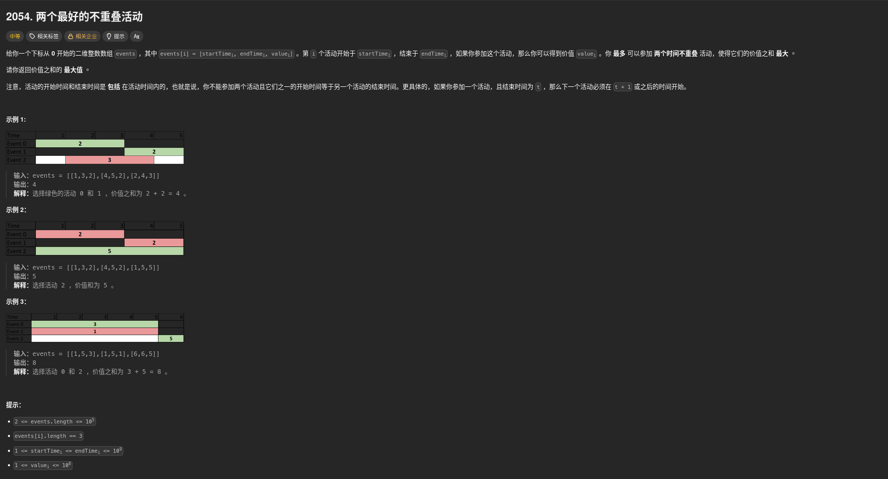

##### 題目：[2054. Two Best Non-Overlapping Events](https://leetcode.com/problems/two-best-non-overlapping-events/)

<!-- more -->



##### 解題思路
這道題目要求我們從一組活動中，選出 **最多兩個** 不重疊的活動，使得價值之和最大。所謂不重疊，是指若選了活動 A 和 B，則 A 的結束時間必須小於 B 的開始時間 (A.end < B.start)

> 這題的挑戰在於活動數量高達 **10^5**，因此我們不能使用 O(N^2) 的雙重迴圈。我們需要一種方法，在遍歷某個活動時，快速找到「在此活動結束之後」所能獲得的最大價值

##### 方法一：排序 + 二分搜尋 (Binary Search) (時間複雜度 O(N log N), 空間複雜度 O(N))
1.  **排序**：按活動的 **開始時間 (startTime)** 進行升序排序
2.  **預處理後綴最大值**：建立一個數組 `maxSuffix[i]`，記錄從索引 i 到最後一個活動中，單個活動的最大價值。這能讓我們在二分搜尋後，直接 O(1) 得到後面區間的最優解
3.  **二分搜尋 (Binary Search)**：遍歷每個活動 i，尋找第一個開始時間大於 `events[i].endTime` 的活動索引 j
4.  **更新答案**：最大價值可能是 `events[i].value + maxSuffix[j]`

```cpp
class Solution {
public:
    int maxTwoEvents(vector<vector<int>>& events) {
        int n = events.size();
        
        // 1. 按開始時間排序
        sort(events.begin(), events.end());

        // 2. 預處理後綴最大值
        // maxSuffix[i] 表示從第 i 個活動到最後一個活動中，單個活動的最大價值
        vector<int> maxSuffix(n + 1, 0);
        for (int i = n - 1; i >= 0; --i) {
            maxSuffix[i] = max(events[i][2], maxSuffix[i + 1]);
        }

        int res = 0;
        for (int i = 0; i < n; ++i) {
            // 情況 A：只參加這一個活動
            res = max(res, events[i][2]);

            // 情況 B：參加這一個活動，再找一個在其結束後才開始的活動
            // 我們要找第一個開始時間 > events[i][1] (endTime) 的活動
            int target = events[i][1];
            
            // 使用二分搜尋
            int left = i + 1, right = n - 1, nextIdx = -1;
            while (left <= right) {
                int mid = left + (right - left) / 2;
                if (events[mid][0] > target) {
                    nextIdx = mid;
                    right = mid - 1;
                } else {
                    left = mid + 1;
                }
            }

            if (nextIdx != -1) {
                res = max(res, events[i][2] + maxSuffix[nextIdx]);
            }
        }

        return res;
    }
};
```