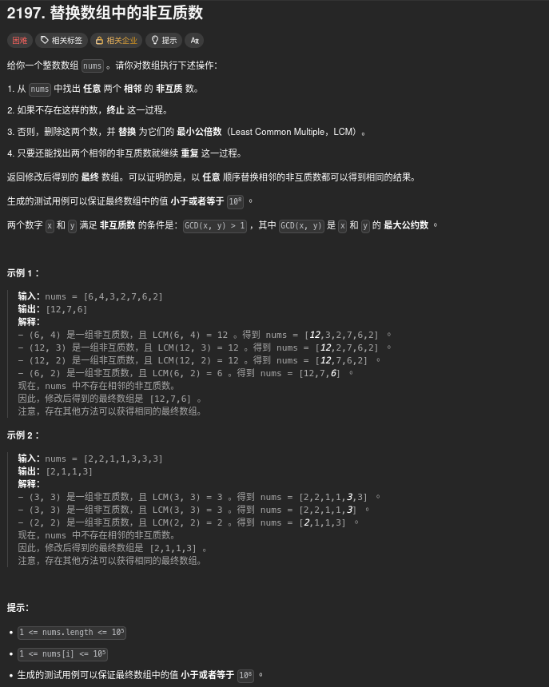

##### 題目：[2197. Replace Non-Coprime Numbers in Array](https://leetcode.com/problems/replace-non-coprime-numbers-in-array/)

<!-- more -->



##### 方法一：棧

**想法很簡單**：

題目保證「無論你先合併哪一對相鄰的非互質數，最後結果都是一樣的」。
所以我們可以從左往右，一個一個數字處理。

**方法**：
1. 用一個 `棧` 來存放已處理的數字。
2. 遍歷陣列 `nums`：
    * 取出當前數 `num`，準備放入 stack。
    * 先檢查棧的頂部元素：
        * 如果 `num` 和棧頂元素 **非互質**（GCD > 1），就把它們 **合併成 LCM**，更新 `num`，並把棧頂元素刪掉。
        * 重複檢查新的棧頂元素，直到互質或 stack 空為止。
3. 將處理完成的 `num` 放入 stack。

**結果**：

* 遍歷完成後，stack 裡的元素 **從底到頂**就是最終答案。
* 這樣可以保證每次都正確合併，而且不用擔心選哪一對會影響結果。

```cpp
class Solution {
public:
    vector<int> replaceNonCoprimes(vector<int>& nums) {
        vector<int> ans;    // 用作 Stack，存放已處理的數字
        for (int num: nums) {   // 遍歷輸入的數字
            while (!ans.empty()) {  // 當 Stack 不為空時
                int g = gcd(ans.back(), num);   // 計算 Stack 頂部元素與當前數字的最大公因數
                if (g > 1) {    // 如果最大公因數大於 1，表示兩數非互質
                    num = ans.back() / g * num; // 計算兩數的最小公倍數
                    ans.pop_back(); // 將 Stack 頂部元素彈出，繼續檢查新的 Stack 頂部元素
                }
                else {  // 如果最大公因數為 1，表示兩數互質
                    break;
                }
            }
            ans.push_back(num); // 將處理後的數字推入 Stack
        }
        return ans;
    }
};

// 作者：力扣官方题解
// 链接：https://leetcode.cn/problems/replace-non-coprime-numbers-in-array/solutions/1328577/ti-huan-shu-zu-zhong-de-fei-hu-zhi-shu-b-mnml/
// 来源：力扣（LeetCode）
// 著作权归作者所有。商业转载请联系作者获得授权，非商业转载请注明出处。
```