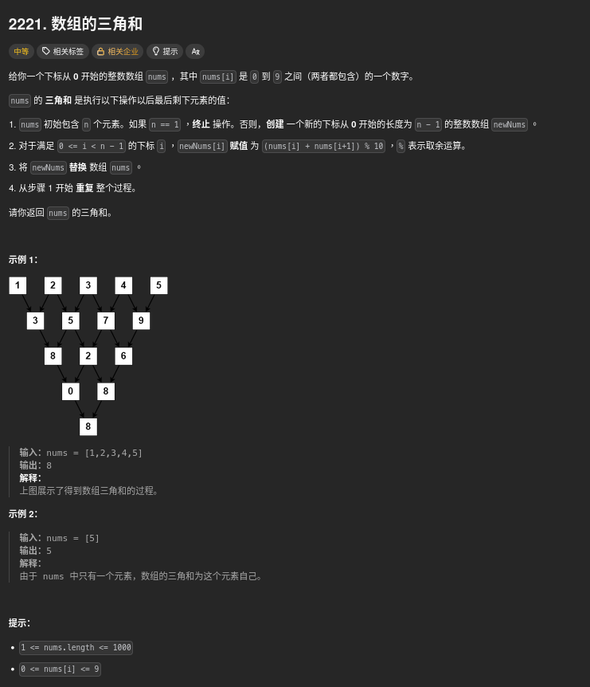

##### 題目：[2221. Find Triangular Sum of an Array](https://leetcode.com/problems/find-triangular-sum-of-an-array/)

<!-- more -->



##### 方法一：組合數

**方法**：
1. 注意到每次計算 newNums[i] = (nums[i] + nums[i+1]) % 10，這其實是將相鄰的兩個數字相加並取模。
2. 最終結果其實是將原始陣列中的每個數字乘以一個組合數，然後將這些結果相加並取模 10。
3. 我們可以利用 Pascal 三角形來計算組合數 C(n-1, i)。
4. 最後答案就是 Σ nums[i] * C(n-1, i) (mod 10)。

```cpp
class Solution {
public:
    int triangularSum(vector<int>& nums) {
        int n = nums.size();    // 取 nums 的長度

        // 建立一個 n*n 的二維陣列 C，用來存組合數 C(i, j) % 10
        // Pascal 三角形公式：C(i,j) = C(i-1,j-1) + C(i-1,j)
        vector<vector<int>> C(n, vector<int>(n, 0));

        // 建 Pascal 三角形 (取 mod 10)
        for (int i = 0; i < n; ++i) {
            C[i][0] = 1;    // C(i,0) = 1
            for (int j = 1; j <= i; ++j) {
                // 每個位置 = 左上 + 正上方，再取 mod 10
                C[i][j] = (C[i - 1][j - 1] + C[i - 1][j]) % 10;
            }
        }

        // 最後答案 = Σ nums[i] * C(n-1, i) (mod 10)
        // 這是因為最後剩下的數字，可以用組合數公式直接計算出來
        int ans = 0;
        for (int i = 0; i < n; ++i) {
            ans = (ans + nums[i] * C[n - 1][i]) % 10;
        }

        return ans;   // 回傳最後的三角和
    }
};
```