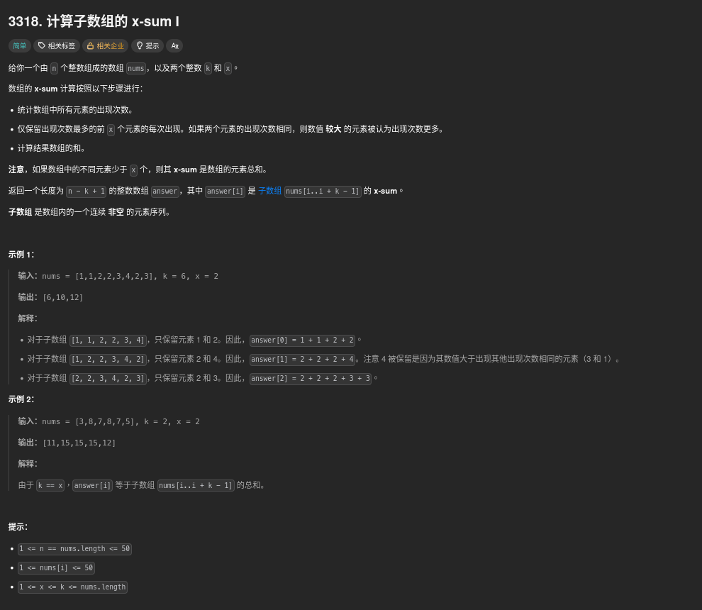

##### 題目：[3318. Find X-Sum of All K-Long Subarrays I](https://leetcode.com/problems/find-x-sum-of-all-k-long-subarrays-i/)

<!-- more -->



##### 方法一：遍歷 + 排序

**方法**：
1. 對每一個長度為 k 的子陣列，使用哈希表計算每個元素的出現次數。
2. 將哈希表中的元素根據出現次數和數值大小進行排序，選出前 x 個元素。
3. 計算這些選中元素在子陣列中的總和，並將結果加入答案陣列中。

```cpp
class Solution {
public:
    vector<int> findXSum(vector<int>& nums, int k, int x) {
        int n = nums.size();
        vector<int> ans;
        
        for (int i = 0; i <= n - k; ++i) {
            // 取子陣列 nums[i..i+k-1]
            vector<int> sub(nums.begin() + i, nums.begin() + i + k);
            
            // 計算每個元素的出現次數
            unordered_map<int, int> cnt;
            for (int num : sub) cnt[num]++;
            
            // 將元素與出現次數存入 vector，用於排序
            vector<pair<int, int>> elements;
            for (auto& p : cnt) {
                // 先按次數降序，如果次數相同，按數值降序
                elements.emplace_back(-p.second, -p.first);
            }
            sort(elements.begin(), elements.end());
            
            // 選前 x 個元素
            int take = min(x, (int)elements.size());
            unordered_set<int> selected;
            for (int j = 0; j < take; ++j) {
                selected.insert(-elements[j].second);
            }
            
            // 計算子陣列中選中元素的總和
            int sum = 0;
            for (int num : sub) {
                if (selected.count(num)) sum += num;
            }
            
            ans.push_back(sum);
        }
        
        return ans;
    }
};
```