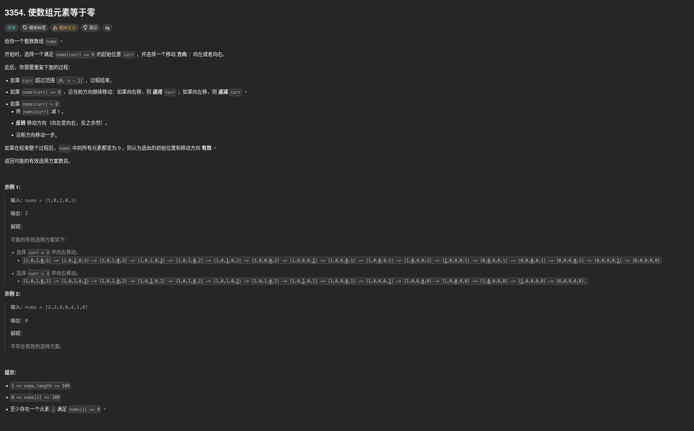

##### 題目：[3345. Make Array Elements Equal to Zero](https://leetcode.com/problems/make-array-elements-equal-to-zero/)

<!-- more -->



##### 方法一：模擬操作 (Simulation)

**思路**：
因為數量不多，可以直接模擬每一次操作
1. 尋找 0 作為起點，分別向左和右進行操作
2. 判斷當前元素是否為 0，若是則繼續往該方向前進，否則 -1，並切換方向到下個位置
3. 當所有元素皆為 0 或移動到陣列邊界時結束，若所有元素皆為 0 則計數器加一

```cpp
class Solution {
public:
    int countValidSelections(vector<int>& nums) {
        int count = 0;
        int nonZeros = 0;
        int n = nums.size();

        for (int i = 0; i < n; i++) {
            if (nums[i] > 0) {
                nonZeros++;
            }
        }

        for (int i = 0; i < n; i++) {
            if (nums[i] == 0) {
                if (isValid(nums, nonZeros, i, -1)) {
                    count++;
                }
                if (isValid(nums, nonZeros, i, 1)) {
                    count++;
                }
            }
        }

        return count;
    }

private:
    bool isValid(const vector<int>& nums, int nonZeros, int start,
                 int direction) {
        int n = nums.size();
        vector<int> temp(nums);
        int curr = start;

        while (nonZeros > 0 && curr >= 0 && curr < n) {
            if (temp[curr] > 0) {
                temp[curr]--;
                direction *= -1;
                if (temp[curr] == 0) {
                    nonZeros--;
                }
            }
            curr += direction;
        }

        return nonZeros == 0;
    }
};

// 作者：力扣官方题解
// 链接：https://leetcode.cn/problems/make-array-elements-equal-to-zero/solutions/3810607/shi-shu-zu-yuan-su-deng-yu-ling-by-leetc-0cvo/
// 来源：力扣（LeetCode）
// 著作权归作者所有。商业转载请联系作者获得授权，非商业转载请注明出处。
```

<br>

##### 方法二：深度優先搜尋 (DFS)

**思路**：跟方法一類似，但使用遞迴實現

```cpp
class Solution {
private:
void dfs(vector<int>& nums, int index ,int pos)
{
    if(index < 0 || index >= nums.size()) return;
    if(nums[index] == 0) dfs(nums, index + pos, pos);
    if(nums[index] > 0)
    {
    nums[index]--;
    dfs(nums, index - pos, -pos);
    } 
}
public:
    int countValidSelections(vector<int>& nums) {
    int res = 0;
    for(int i = 0 ; i < nums.size() ; i++)
    {
        if(nums[i] != 0) continue;
        vector<int> temp(nums);
        dfs(temp,i, 1);
        if(count(temp.begin(), temp.end() , 0) == nums.size())  res++;
        temp = nums;
        dfs(temp, i, -1);
        if(count(temp.begin(), temp.end() , 0) == nums.size())  res++;
    }
    return res;
    }
};

// 作者：清风似想清雅
// 链接：https://leetcode.cn/problems/make-array-elements-equal-to-zero/solutions/
// 来源：力扣（LeetCode）
// 著作权归作者所有。商业转载请联系作者获得授权，非商业转载请注明出处。
```

<br>

##### 方法三： 二分搜尋 (Binary Search)

**思路**：
以選擇的起始位置為分界線，選擇的方向比另一個方向大一或者相等的時候，最終可以滿足題意
1. 先計算出總和，然後遍歷，並判斷兩個方向的和差，滿足上述要求的位置和方向計入最終結果

```cpp
#include <algorithm>

class Solution {
public:
    int countValidSelections(vector<int>& nums) {
        for(int i {1}; i < nums.size(); ++i) { // 前缀和
            nums[i] += nums[i - 1];
        }

        int len = nums.size();
        int half {(nums[nums.size() - 1]) >> 1}, ans {0};
        auto idx {std::lower_bound(nums.begin(), nums.end(), half)}; // 二分法確定遍歷的起始位置

        for(int i = idx - nums.begin(); i < nums.size(); ++i) {
            int cur {i == 0 ? nums[i] : nums[i] - nums[i-1]};
            if(cur > 0) { // 非 0，不能選擇為起始位置
                continue;
            }
            int cur_s {nums[i]}, other_s {nums[len - 1] - nums[i]};
            if(abs(cur_s - other_s) == 1) { // 有一個方向滿足題意
                ++ans;
            } else if (cur_s == other_s) { // 兩個方向均可以
                ans += 2;
            }
            if(cur_s - other_s > 1) { // cur_s 已經大於 other_s+1 ，後續不可能再出現滿足題意的位置
                break;
            }
        }
        
        return ans;
    }
private:
    int abs(int n) {
        return n < 0 ? -n : n;
    }
};

// 作者：lc_D_a
// 链接：https://leetcode.cn/problems/make-array-elements-equal-to-zero/solutions/3817289/er-fen-fa-dui-bian-li-qi-shi-wei-zhi-jin-r97u/
// 来源：力扣（LeetCode）
// 著作权归作者所有。商业转载请联系作者获得授权，非商业转载请注明出处。
```