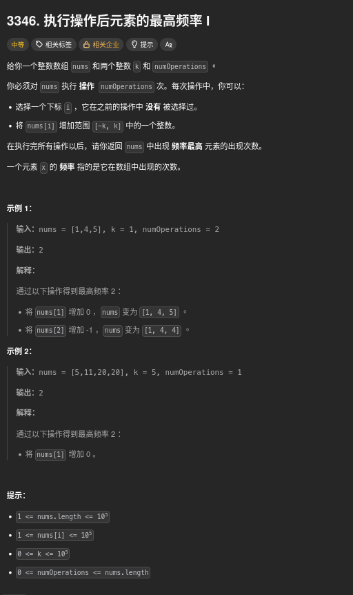

##### 題目：[3346. Maximum frequency of an element after performing operations I](https://leetcode.com/problems/maximum-frequency-of-an-element-after-performing-operations-i/)

<!-- more -->



##### 方法一：暴力檢查所有候選值 (O(n log n) 解法)
**題目說明**：
題目說傳入一個 List `nums`，以及兩個整數 `k` 和 `numOperations`。
我們可以對 `nums` 執行 `numOperations` 次操作，每次操作可以選擇一個未被選過的索引 `i`，並將 `nums[i]` 增加一個介於 `[-k, k]` 的整數。
我們的目標是讓 `nums` 中出現頻率最高的元素的出現次數最大化，並返回這個最大頻率。


**思路**：
1. 我們可以先將 `nums` 進行排序，這樣相同的元素會被聚集在一起，方便我們計算頻率。
2. 接著，我們可以考慮所有可能的目標值 `X`，這些目標值可以是 `nums` 中的任何元素，或者是 `nums` 中的元素加上或減去 `k`。
3. 對於每個目標值 `X`，我們計算：
   - `equalCount`：`nums` 中等於 `X` 的元素數量。
   - `totalInRangeCount`：`nums` 中在 `[X - k, X + k]` 範圍內的元素數量。
   - `changeableCount`：可以通過操作改變成 `X` 的元素數量，即 `totalInRangeCount - equalCount`。
4. 最後，我們計算對於每個目標值 `X`，我們能達到的最大頻率為 `equalCount + min(changeableCount, numOperations)`，並更新全局的最大頻率。


```cpp
class Solution {
public:
    int maxFrequency(vector<int>& nums, int k, int numOperations) {
        
        sort(nums.begin(), nums.end());

        set<long long> candidates; 
        for (int num : nums) {
            candidates.insert((long long)num);
            candidates.insert((long long)num - k);
            candidates.insert((long long)num + k);
        }

        int max_freq = 0;
        
        for (long long target : candidates) {
            
            // a. 計算 equalCount (等於 target 的數量)
            auto it_eq_lower = lower_bound(nums.begin(), nums.end(), target);
            auto it_eq_upper = upper_bound(nums.begin(), nums.end(), target);
            int equalCount = distance(it_eq_lower, it_eq_upper);

            // b. 計算 totalInRangeCount (所有在 [target-k, target+k] 範圍內的數量)
            auto it_range_lower = lower_bound(nums.begin(), nums.end(), target - k);
            auto it_range_upper = upper_bound(nums.begin(), nums.end(), target + k);
            int totalInRangeCount = distance(it_range_lower, it_range_upper);

            // c. 計算 changeableCount (可修改的數量)
            //    (總範圍內的數量) - (本來就相等的數量) = (需要操作才能變相等的數量)
            int changeableCount = totalInRangeCount - equalCount;

            // d. 計算當前 X 的最終頻率
            //    (本來就相等的) + (我們最多能修改過來的)
            int current_freq = equalCount + min(changeableCount, numOperations);

            // e. 更新最大值
            max_freq = max(max_freq, current_freq);
        }

        return max_freq;
    }
};
```