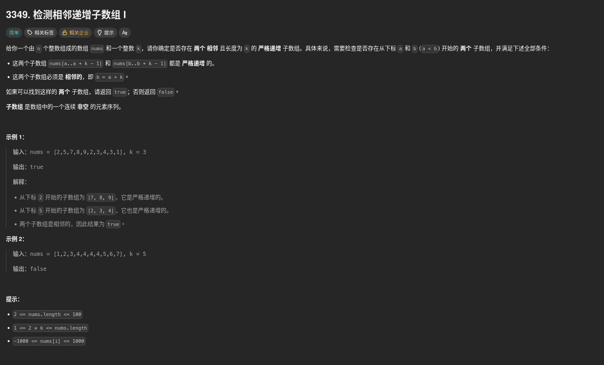

##### 題目：[3349. Adjacent Increasing Subarrays Detection I](https://leetcode.com/problems/adjacent-increasing-subarrays-detection-i/)

<!-- more -->



##### 方法一：暴力枚舉 + 子函式檢查嚴格遞增

1. 用一個內部函式 is_increasing(start) 來判斷子陣列是否嚴格遞增。
2. 依序枚舉 a，檢查 nums[a:a+k] 與 nums[a+k:a+2k] 是否都嚴格遞增。
3. 若找到一組符合條件，立即回傳 True。
4. 若都找不到，最後回傳 False。

> 時間複雜度：`O(n*k)`，其中 n 是陣列長度，k 是子陣列長度。

```python
class Solution:
    def hasIncreasingSubarrays(self, nums: List[int], k: int) -> bool:
        n = len(nums)
        
        # 檢查從 index i 開始的長度 k 子陣列是否嚴格遞增
        def is_increasing(start: int) -> bool:
            for j in range(start + 1, start + k):
                if nums[j] <= nums[j - 1]:
                    return False
            return True
        
        # 檢查所有可能的 a (確保 a + 2*k - 1 不超出範圍)
        for a in range(n - 2 * k + 1):
            b = a + k  # 相鄰的下一個子陣列
            if is_increasing(a) and is_increasing(b):
                return True
        
        return False
```

```cpp
class Solution {
public:
    bool hasIncreasingSubarrays(vector<int>& nums, int k) {
        int n = nums.size();

        // 檢查從 start 開始的長度為 k 的子陣列是否嚴格遞增
        auto is_increasing = [&](int start) -> bool {
            for (int j = start + 1; j < start + k; ++j) {
                if (nums[j] <= nums[j - 1])
                    return false;
            }
            return true;
        };

        // 檢查所有可能的起點 a
        for (int a = 0; a + 2 * k <= n; ++a) {
            int b = a + k; // 相鄰的下一個子陣列
            if (is_increasing(a) && is_increasing(b))
                return true;
        }

        return false;
    }
};
```

<br>

---

<br>

##### 方法二：利用遞增連續長度（O(n) 解法） (由 ChatGPT 提供)

**思路**：

我們不需要每次都重新檢查一整段子陣列是否嚴格遞增。
可以一次遍歷整個陣列，記錄「以 `nums[i]` 結尾的嚴格遞增子序列長度」，
再用這個資訊快速判斷是否存在兩段長度為 `k` 且相鄰的遞增子陣列。

以 `nums = [2,5,7,8,9,2,3,4,3,1], k = 3` 為例：

| i | nums[i] | 連續遞增長度 len[i] |
| - | ------- | ------------- |
| 0 | 2       | 1             |
| 1 | 5       | 2             |
| 2 | 7       | 3             |
| 3 | 8       | 4             |
| 4 | 9       | 5             |
| 5 | 2       | 1             |
| 6 | 3       | 2             |
| 7 | 4       | 3             |
| 8 | 3       | 1             |
| 9 | 1       | 1             |

現在我們知道：

* `len[2] = 3` → 表示 `nums[0..2]` 是遞增（實際上我們關心 `nums[0..2]` 是一段長度 3 的遞增子陣列）
* `len[7] = 3` → 表示 `nums[5..7]` 是另一段長度 3 的遞增子陣列
* 並且它們是相鄰的 (`5 == 2 + 3`)
  → 滿足條件

---

##### 公式推導

當 `len[i] >= k` 表示有一段嚴格遞增子陣列結束於 `i`。
那它的起點是 `i - k + 1`。
我們只要確認「當前這段」的起點是否緊接著前一段遞增子陣列的終點即可。

---

```python
class Solution:
    def hasIncreasingSubarrays(self, nums: List[int], k: int) -> bool:
        n = len(nums)
        inc = [1] * n

        # 計算每個位置的連續嚴格遞增長度
        for i in range(1, n):
            if nums[i] > nums[i - 1]:
                inc[i] = inc[i - 1] + 1

        # 檢查是否存在兩個相鄰的長度為 k 的遞增子陣列
        for i in range(k - 1, n):
            if inc[i] >= k:
                start_a = i - k + 1
                start_b = start_a + k
                if start_b + k - 1 < n and inc[start_b + k - 1] >= k:
                    return True

        return False
```

```cpp
class Solution {
public:
    bool hasIncreasingSubarrays(vector<int>& nums, int k) {
        int n = nums.size();
        vector<int> inc(n, 1);

        // 計算每個位置的連續嚴格遞增長度
        for (int i = 1; i < n; ++i) {
            if (nums[i] > nums[i - 1])
                inc[i] = inc[i - 1] + 1;
        }

        // 檢查是否存在兩個相鄰的長度為 k 的遞增子陣列
        for (int i = k - 1; i < n; ++i) {
            if (inc[i] >= k) {
                int start_a = i - k + 1;
                int start_b = start_a + k;
                if (start_b + k - 1 < n && inc[start_b + k - 1] >= k)
                    return true;
            }
        }

        return false;
    }
};
```

---

##### 時間複雜度

* **O(n)**：僅需單次遍歷即可得出遞增長度並檢查條件。
* **O(n)** 空間：需要一個 `inc` 陣列。

---

##### 小結

| 方法  | 思路             | 時間複雜度    | 空間複雜度 |
| --- | -------------- | -------- | ----- |
| 方法一 | 暴力檢查每一對相鄰子陣列   | O(n × k) | O(1)  |
| 方法二 | 預處理遞增長度，一次遍歷判斷 | O(n)     | O(n)  |