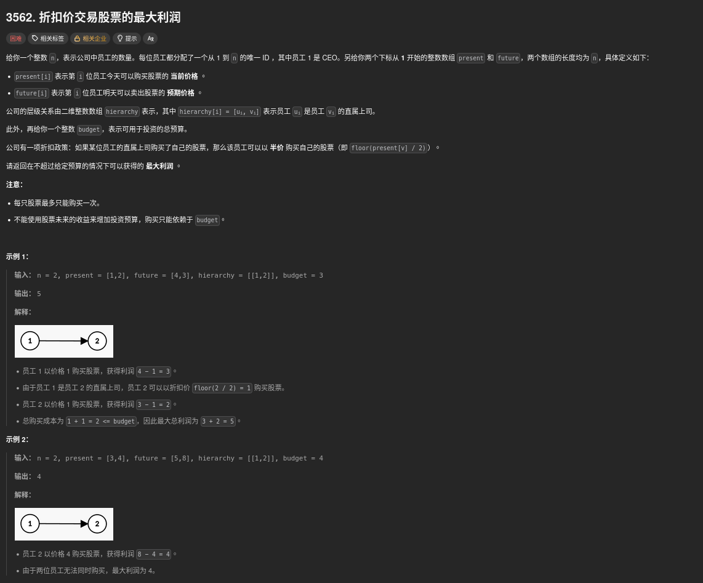
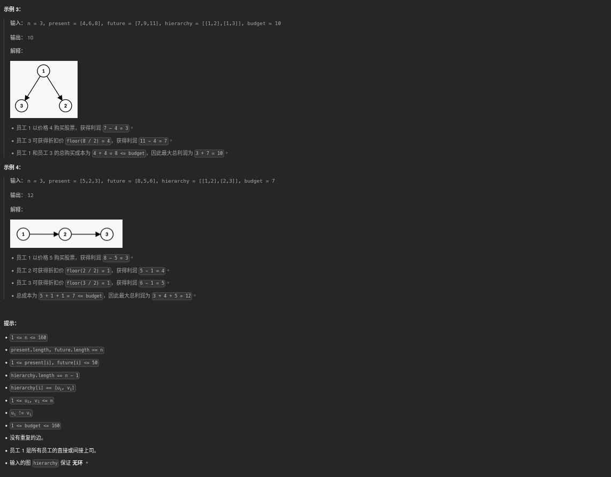

##### 題目：[3562. Maximum Profit from Trading Stocks with Discounts](https://leetcode.com/problems/maximum-profit-from-trading-stocks-with-discounts/)

<!-- more -->




##### 方法一：
1. 建立樹狀結構，並使用 DFS 從底向上計算每個節點的最大利潤
2. 使用三維 DP 陣列 dp[u][b][d]，其中 u 表示當前節點，b 表示當前預算，d 表示上司是否購買 (0: 父節點未購買, 1: 父節點已購買)
3. 對於每個節點，有兩種情況：
   - 不買股票：計算所有子節點在不買股票的情況下的最大利潤
   - 買股票：根據上司是否購買決定購買價格，然後計算所有子節點在買股票的情況下的最大利潤
4. 最終結果為根節點在不超過預算的情況下的最大利潤

```cpp
class Solution {
public:
    int maxProfit(int n, vector<int>& present, vector<int>& future, vector<vector<int>>& hierarchy, int budget) {
        auto blenorvask = hierarchy;    // 將輸入存放在變數中間

        // 建樹 (1-indexed)
        vector<vector<int>> tree(n + 1);
        for (const auto& edge : hierarchy) {
            tree[edge[0]].push_back(edge[1]);
        }

        const int NGE_INF = -1e9;

        // dp[u][b][d]
        // u: 當前節點
        // b: 當前預算
        // d: 上司是否購買 (0: 父節點未購買, 1: 父節點已購買)
        vector<vector<vector<int>>> dp(
            n + 1, vector<vector<int>>(budget + 1, vector<int>(2, NGE_INF))
        );

        function<void(int)> dfs = [&](int u) {
            for (int v : tree[u]) {
                dfs(v);
            }

            for (int p = 0; p <=1; p++) {
                // 情況 1: 不買
                vector<int> notBuy(budget + 1, 0);
                for (int v : tree[u]) {
                    vector<int> temp(budget + 1, NGE_INF);
                    for (int i = 0; i <= budget; i++) {
                        if (notBuy[i] == NGE_INF) continue;
                        for (int j = 0; j <= budget - i; j++) {
                            if (dp[v][j][0] == NGE_INF) continue;
                            temp[i + j] = max(temp[i + j], notBuy[i] + dp[v][j][0]);
                        }
                    }
                    notBuy = move(temp);
                }

                for (int b = 0; b <= budget; b++) {
                    dp[u][b][p] = notBuy[b];
                }

                // 情況 2: 買
                int cost = (p == 1 ? present[u - 1] / 2 : present[u - 1]);
                int gain = future[u - 1] - cost;
                if (cost <= budget) {
                    vector<int> buy(budget + 1, NGE_INF);
                    buy[cost] = gain;

                    for (int v : tree[u]) {
                        vector<int> temp(budget + 1, NGE_INF);
                        for (int i = 0; i <= budget; i++) {
                            if (buy[i] == NGE_INF) continue;
                            for (int j = 0; j <= budget - i; j++) {
                                if (dp[v][j][1] == NGE_INF) continue;
                                temp[i + j] = max(temp[i + j], buy[i] + dp[v][j][1]);
                            }
                        }
                        buy = move(temp);
                    }

                    for (int b = 0; b <= budget; b++) {
                        dp[u][b][p] = max(dp[u][b][p], buy[b]);
                    }
                }
            }
        };

        dfs(1);

        int result = 0;
        for (int b = 0; b <= budget; b++) {
            result = max(result, dp[1][b][0]);  // 根節點父節點不存在, 視為未購買
        };

        return result;
    }
};
```