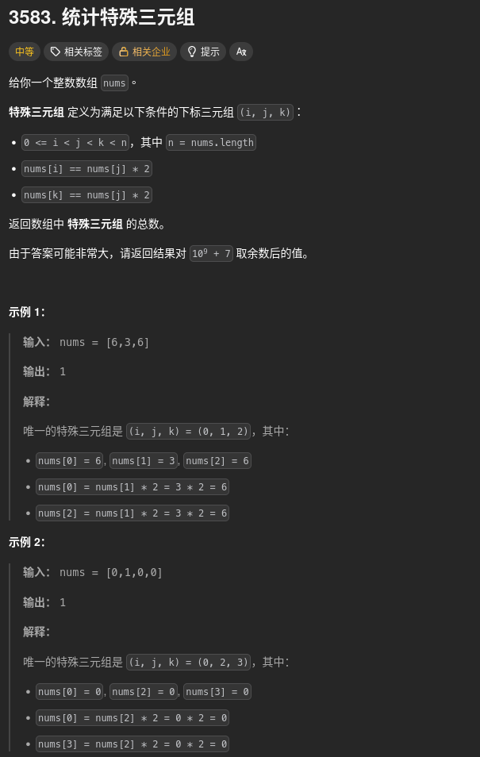
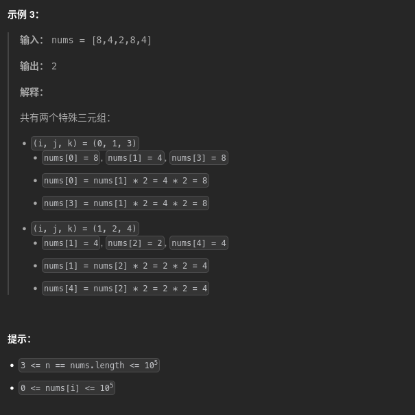

##### 題目：[3583. Count Special Triplets](https://leetcode.com/problems/count-special-triplets/)

<!-- more -->




##### 方法一：
**題意**：
1. 索引順序：`0 <= i < j < k < n` (即三個索引從左到右遞增)
2. 數值關係：
    - `nums[i] == nums[j] * 2`
    - `nums[k] == nums[j] * 2`

也就是：
> 選一個中間數 `nums[j]`，左邊找多少個 `2 * nums[j]`，右邊也找多少個 `2 * nums[j]`
> -> 組合數為：**leftCount × rightCount**

**思路**：
對每個 `j`：
- leftCount = 左側出現過多少個 2 * nums[j]
- rightCount = 右側未來還剩多少個 2 * nums[j]

##### 方法一：線性掃描 + 前後桶計數 (時間複雜度 O(N))
1. 使用兩個頻率桶 `leftFreq` 和 `rightFreq` 分別記錄左側和右側的數字出現次數
2. 初始化時，將所有數字放入 `rightFreq`
3. 遍歷每個 `j`：
   - 從 `rightFreq` 中扣掉 `nums[j]`
   - 計算 `target = nums[j] * 2`
   - 累加 `leftFreq[target] * rightFreq[target]` 到答案

> nums[j] * 2 可能會超過 nums[i] 的範圍 (0 <= nums[i] <= 10^5)，所以需要設置一個足夠大的桶 (MAXV = 200000)

```cpp
class Solution {
public:
    int specialTriplets(vector<int>& nums) {
        const int MOD = 1'000'000'007;
        const int MAXV = 200000; // nums[i] 最大為 1e5，因此 *2 後最大可到 2e5

        vector<long long> leftFreq(MAXV + 1, 0);
        vector<long long> rightFreq(MAXV + 1, 0);

        // 建立右側頻率表 (初始時所有元素都在右側)
        for (int x : nums) {
            rightFreq[x]++;
        }

        long long ans = 0;
        int n = nums.size();

        for (int j = 0; j < n; j++) {
            int x = nums[j]; 
            rightFreq[x]--; // j 位置從右側移除 (因為現在要把它當作中間點 j)

            long long target = (long long)x * 2;
            if (target <= MAXV) {
                // 左邊匹配 * 右邊匹配 = 本次 j 能貢獻的特殊三元組數量
                ans = (ans + leftFreq[target] * rightFreq[target]) % MOD;
            }

            leftFreq[x]++; // j 位置加入左側 (下一輪 j' 的左邊)
        }

        return ans;
    }
};
```