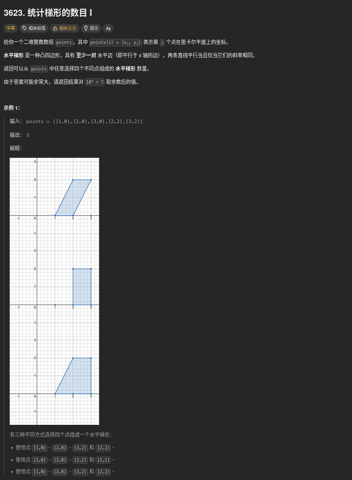
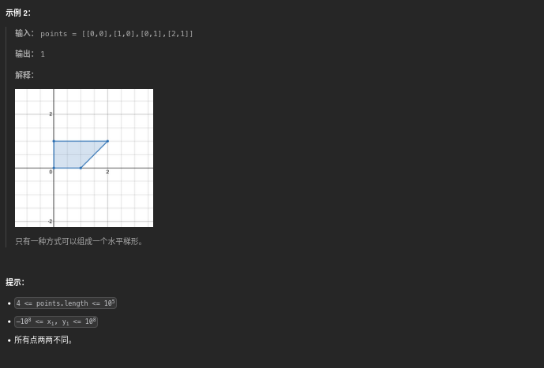
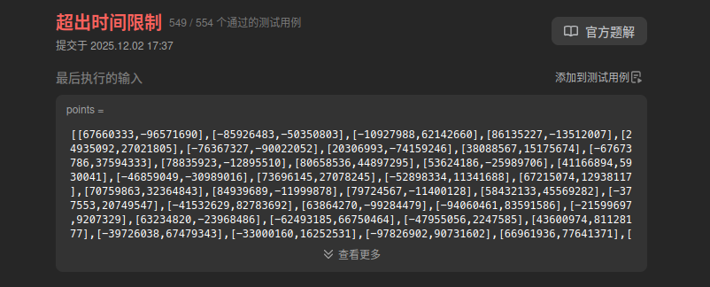

##### 題目：[3623. Count Number of Trapezoids I](https://leetcode.com/problems/count-number-of-trapezoids-i/)

<!-- more -->




##### 方法一：
**題意**：
從給定的點集中，選出 **四個不同的點**，組成一個 **水平梯形**，問有多少種這樣的組合
> 最終結果需要對 10^9 + 7 取餘數

根據題目定義：
> 水平梯形 是一種凸四邊形，具有 **至少一對** 水平邊（即平行於 x 軸的邊）。兩條直線平行當且僅當它們的斜率相同。
1. **凸四邊形**：四個點構成的圖形不能凹進去
2. **至少一對水平邊**：至少有兩條邊是 **水平的** (也就是兩個點的 y 座標相同)
3. **水平邊 = 平行於 x 軸的邊**：兩個點的 y 座標相同，所以是水平的

所以 **水平梯形** 的定義可以簡化為：
> 四個點中，有兩對點的 y 座標相同，且這兩對點分別形成水平邊

---

舉個例子(拿示例1來說明)：
- points = `[[1,0],[2,0],[3,0],[2,2],[3,2]]`
- 所有點按 y 座標分組：
  - y = 0: `[[1,0],[2,0],[3,0]]` (3個點)
  - y = 2: `[[2,2],[3,2]]` (2個點)
- 我們現在要找的是：**從這些分組中，選出兩組 y 座標相同的點，每組至少選兩個點，來形成水平梯形**。
例如：
- 從 `y = 0` 組中選出兩個點 ([1,0] 和 [3,0])
- 從 `y = 2` 組中選出兩個點 ([2,2] 和 [3,2])
- 這四點可以構成一個上底為 y = 2，下底為 y = 0 的水平梯形。

**思路**：
1. 統計每個 y 座標對應的點數量
2. 對於每個 y 座標組合，計算從每組中選出兩個點的組合數
3. 將所有組合數相乘並累加，最後對 10^9 + 7 取餘數

##### 方法一：暴力雙重迴圈 (時間複雜度 O(N^2))
1. 使用哈希表統計每個 y 座標對應的點數量
2. 對於每個 y 座標組合，計算從每組中選出兩個點的組合數 C(count, 2) = count * (count - 1) / 2

```cpp
class Solution {
public:
    int countTrapezoids(vector<vector<int>>& points) {
        const int MOD = 1e9 + 7;
        unordered_map<int, long long> yCount;

        // 統計每個 y 座標對應的點數量
        for (const auto& point : points) {
            yCount[point[1]]++;
        }

        long long result = 0;

        // 計算每個 y 座標組合的組合數
        for (auto it1 = yCount.begin(); it1 != yCount.end(); ++it1) {
            for (auto it2 = next(it1); it2 != yCount.end(); ++it2) {
                long long count1 = it1->second;
                long long count2 = it2->second;

                // 從每組中選出兩個點的組合數
                if (count1 >= 2 && count2 >= 2) {
                    long long combinations = (count1 * (count1 - 1) / 2) * (count2 * (count2 - 1) / 2);
                    result = (result + combinations) % MOD;
                }
            }
        }

        return static_cast<int>(result);
    }
};
```

但是這個方法在 y 座標種類很多的情況下，時間複雜度會變得很高 (O(N^2))，可能會導致超時。


---

##### 方法二：數學優化 (時間複雜度 O(N))
**優化思路**：
1. 統計每個 y 座標對應的點數量
2. 計算每個 y 座標組合的組合數，使用數學公式來優化計算
   - 設 `a_i` 為第 i 個 y 座標的點數量組合數 (C(count, 2))

```cpp
class Solution {
public:
    int countTrapezoids(vector<vector<int>>& points) {
        const int MOD = 1e9 + 7;
        unordered_map<int, long long> yCount;

        // 統計每個 y 座標對應的點數量
        for (const auto& point : points) {
            yCount[point[1]]++;
        }

        vector<long long> a;    // 存儲每個 y 座標的點數量
        long long sum_a = 0;    // sum(a_i)
        long long sum_a2 = 0;   // sum(a_i^2)

        for (auto& [y, count] : yCount) {
            long long combinations = count * (count - 1) / 2; // C(count, 2)
            a.push_back(combinations);
            sum_a = (sum_a + combinations) % MOD;
            sum_a2 = (sum_a2 + combinations * combinations) % MOD;
        }

        // 公式 (sum_a^2 - sum_a2) / 2
        // 代表所有不同 y 組合 i<j 的乘積總和 sum_{i<j} a[i]*a[j]
        long long square = (sum_a * sum_a) % MOD;
        long long result = (square - sum_a2 + MOD) % MOD;   // + MOD 避免負數
        result = (result * 500000004) % MOD; // 乘以 1/2 的模反元素

        return static_cast<int>(result);
    }
};
```