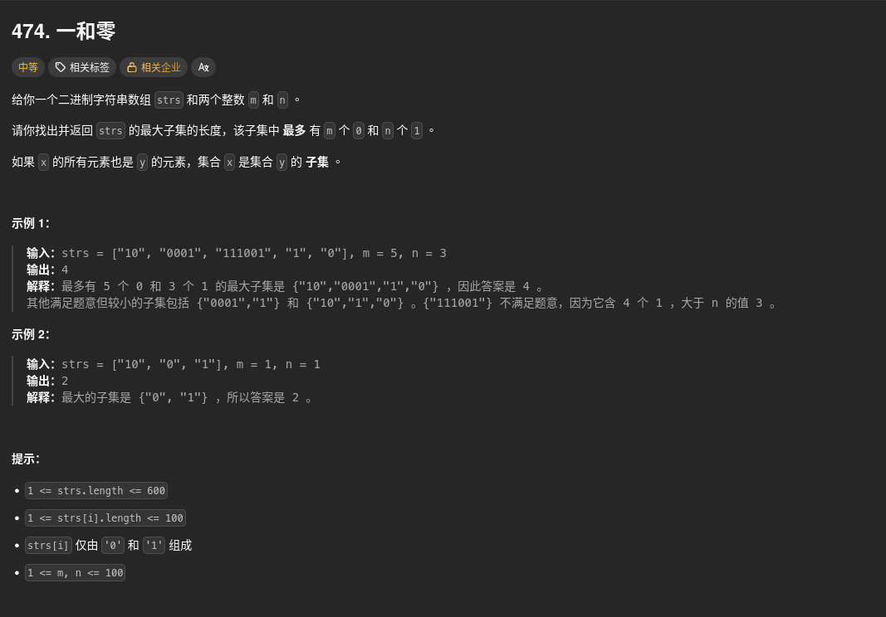

##### 題目：[474. Ones and Zeroes](https://leetcode.com/problems/ones-and-zeroes/)

<!-- more -->



##### 方法一：動態規劃 (Dynamic Programming)
**方法**：
1. 定義一個二維動態規劃陣列 `dp`，其中 `dp[i][j]` 表示當最多使用 `i` 個 '0'和 `j` 個 '1' 時，能選出的最大字符串數量（子集長度）。
2. 初始化 `dp` 陣列為大小 `(m+1) x (n+1)` 的零矩陣。
3. 遍歷每個字符串 `s`：
   - 統計字符串中 '0' 和 '1' 的數量。
   - 從後往前更新 `dp` 陣列，避免重複使用同一字符串：
     - 對於每個可能的 '0' 和 '1' 數量，更新 `dp[i][j]` 為不選擇當前字符串和選擇當前字符串兩者的最大值。
4. 最終返回 `dp[m][n]`，即在最多使用 `m` 個 '0' 和 `n` 個 '1' 時能選出的最大子集長度。


```cpp
class Solution {
public:
    int findMaxForm(vector<string>& strs, int m, int n) {
        // dp[i][j] 表示：當最多使用 i 個 '0' 和 j 個 '1' 時, 能選出的最大字符串數量 (子集長度)
        vector<vector<int>> dp(m + 1, vector<int>(n + 1, 0));

        // 遍歷每個字符串
        for (const auto& s : strs) {
            int zeros = 0, ones = 0;

            // 統計字符串中 '0' 和 '1' 的數量
            for (char c : s) {
                if (c == '0') zeros++;
                else if (c == '1') ones++;
            }

            if (zeros > m || ones > n) continue; // 直接跳過不符合的

            // 從後往前更新 dp 陣列，避免重複使用同一字符串
            for (int i = m; i >= zeros; --i) {
                for (int j = n; j >= ones; --j) {
                    // 狀態轉移
                    // 1. 不選當前字符串 (dp[i][j]保持原值)
                    // 2. 選擇當前字符串: 需要空間 i - zeros 和 j - ones, 再 +1
                    // 取兩者的最大值
                    dp[i][j] = max(dp[i][j], dp[i - zeros][j - ones] + 1);
                }
            }
        }
        return dp[m][n];
    }
};
```

---

##### 時間複雜度：
* **O(L * m * n)**：其中 L 是字符串數組 strs 的長度，m 和 n 分別是給定的 '0' 和 '1' 的最大數量

##### 空間複雜度：
* **O(m * n)**：用於存儲動態規劃陣列 dp