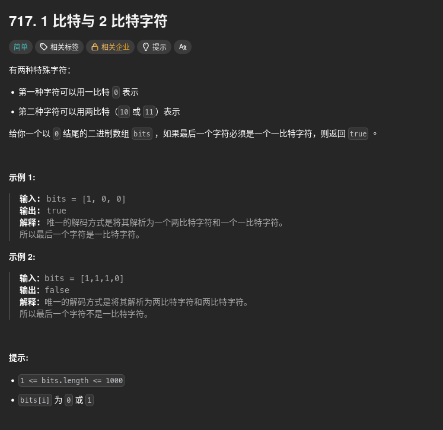

##### 題目：[717. 1-bit and 2-bit Characters](https://leetcode.com/problems/1-bit-and-2-bit-characters/)

<!-- more -->



##### 方法一：貪心法
**方法**：
1. 從左到右遍歷, 根據 bits[i] 的值決定是跳過 1 個還是 2 個位置
2. 最後判斷 i 是否停在倒數第二個位置, 若是則表示最後一個字元則回傳 true

> 時間複雜度：`O(n)`，其中 n 是陣列 bits 的長度。
> 空間複雜度：`O(1)`，使用常數級別的額外空間。

```cpp
class Solution {
public:
    bool isOneBitCharacter(vector<int>& bits) {
        auto n{ bits.size() };
        auto i{ 0 };
        while (i < n - 1) {
            // 一路從左掃到倒數第二個位置
            // 如果是 1，表示這裡一定是 2-bit 字元（10/11），右移兩格
            // 如果是 0，就是 1-bit 字元，右移一格
            if (bits[i] == 1) {
                i += 2;
            } else {
                i += 1;
            }
        }
        
        // 最後停在最後一格才代表它是獨立的一比特字元
        return i == n - 1;
    }
};
```