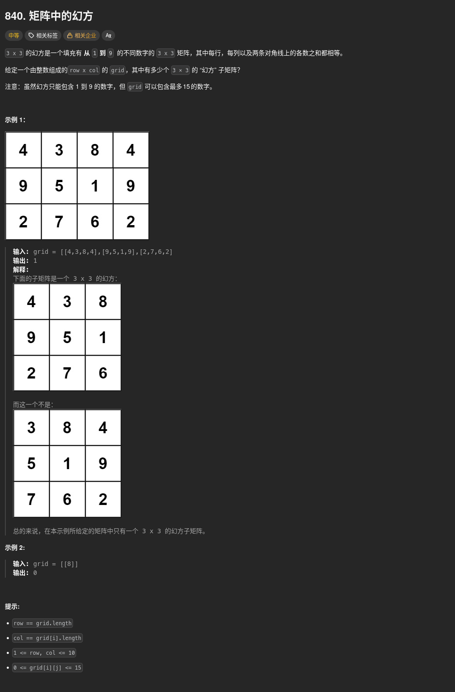

##### 題目：[840. Magic Squares In Grid](https://leetcode.com/problems/magic-squares-in-grid/)

<!-- more -->



##### 解題思路
雖然這題被標記成「中等」難度，但實際上更像一個 **邏輯判斷** 題目，我們的任務是在一個大矩陣中，找出所有符合幻方 (Magic Square) 定義的 3x3 子矩陣數量

> 3x3 幻方是啥？
> 1. 包含數字 1 到 9，且每個數字只能出現一次
> 2. 每一行、每一列及兩條對角線的和都必須相等，且等於 15
> 3. 中心點必須是 5（這是幻方的一個特性）

##### 方法一：暴力檢查每一個 3x3 子矩陣 (時間複雜度 O(M * N), 空間複雜度 O(1))
不需要複雜的演算法，只需要遍歷矩陣中每一個可能的 3×3 區域左上角，並進行嚴格的檢查
1. 遍歷起點: 從 `grid[0][0]` 到 `grid[rows-3][cols-3]`
2. 快速剪枝: 檢查中心點是否為 5，若不是則直接跳過
3. 數字校驗: 使用一個長度為 10 的陣列來記錄 1~9 出現的次數，若有重複或不在範圍內則跳過
4. 和的校驗: 檢查每一行、每一列及兩條對角線的和是否皆為 15

```cpp
class Solution {
public:
    int numMagicSquaresInside(vector<vector<int>>& grid) {
        int rows = grid.size();
        int cols = grid[0].size();
        int count = 0;

        // 遍歷所有可能的 3x3 矩陣左上角 (i, j)
        for (int i = 0; i <= rows - 3; ++i) {
            for (int j = 0; j <= cols - 3; ++j) {
                if (isValid(grid, i, j)) {
                    count++;
                }
            }
        }
        return count;
    }

private:
    bool isValid(vector<vector<int>>& grid, int r, int c) {
        // 1. 幻方的核心特徵：中心點必須是 5
        if (grid[r + 1][c + 1] != 5) return false;

        // 2. 檢查數字是否為 1~9 且不重複
        vector<int> record(10, 0);
        for (int i = r; i < r + 3; ++i) {
            for (int j = c; j < c + 3; ++j) {
                int val = grid[i][j];
                if (val < 1 || val > 9 || ++record[val] > 1) return false;
            }
        }

        // 3. 檢查行、列、對角線的和是否為 15
        // 檢查行
        for (int i = 0; i < 3; ++i) {
            if (grid[r + i][c] + grid[r + i][c + 1] + grid[r + i][c + 2] != 15) return false;
        }
        // 檢查列
        for (int j = 0; j < 3; ++j) {
            if (grid[r][c + j] + grid[r + 1][c + j] + grid[r + 2][c + j] != 15) return false;
        }
        // 檢查對角線
        if (grid[r][c] + grid[r + 1][c + 1] + grid[r + 2][c + 2] != 15) return false;
        if (grid[r][c + 2] + grid[r + 1][c + 1] + grid[r + 2][c] != 15) return false;

        return true;
    }
};
```