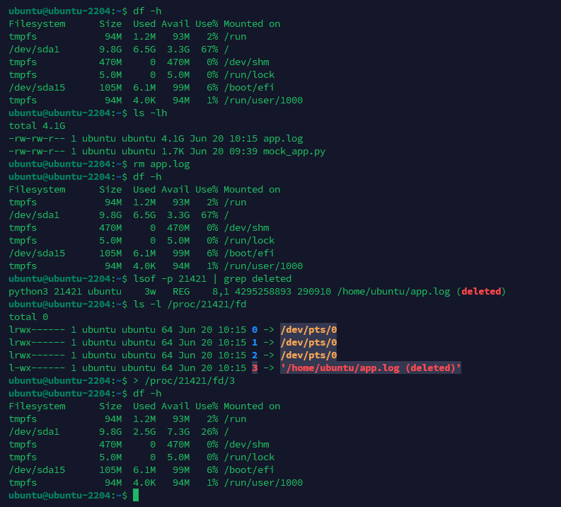

在維護伺服器時，我們偶爾會遇到一個巨大的日誌檔案把硬碟空間佔到了 100%，然後一時手快直接用 `rm` 命令刪了，卻發現磁碟空間完全沒有被釋放

<!-- more -->

通常情況下，這時候只要把服務重啟下，空間就會被釋放出來。但如果今天遇到的是 **不允許重啟服務** 的情況，該如何在不停機的情況下把十 GB 的空間謄出來呢？

<br>

## 為什麼用 rm 刪除後空間沒釋放
在 Linux 的檔案系統中，當一個檔案仍然被某個運行中的行程 (Process) 開啟與引用時，即使你在硬碟目錄下用 `rm` 刪除了它，系統核心仍然會保留這個檔案的 Inode 與實體資料區塊，直到沒有任何行程佔用為止。這就是為什麼「檔案不見了，磁碟卻還是滿的」。(Windows 下是直接不讓你刪除檔案)

既然不能動業務進程，我們就換個思路：**直接去記憶體裡找出它的檔案指標，然後清空它。**

<br>

## 正確作法

如果你還沒按下 `rm`，**千萬不要刪除檔案**。最安全且不需要重啟服務的做法，是直接把檔案的內容「抽乾」，保留空殼給進程繼續寫入。

你可以直接在終端機對著該日誌檔使用**空重定向**：

```bash
> app.log
```

執行後，幾十 GB 的空間會瞬間釋放，且服務完全無感，依然能正常將新日誌寫入該檔案。

<br>

## 已經用 rm 刪除了怎麼辦？

如果你已經把檔案刪了，陷入了死局。既然不能動業務進程，我們就換個思路：直接去記憶體裡找出它的檔案指標，然後清空它。

<br>

### 第一步：順藤摸瓜，找出被隱藏的檔案指標
首先，我們需要找出系統裡「已經被刪除，但在記憶體裡依舊活躍」的檔案。使用 `lsof` 命令配合 `grep` 來過濾：

```bash
ubuntu@ubuntu-2204:~$ lsof | grep deleted
python3 21421 ubuntu    3w   REG    8,1 4295258893 290910 /home/ubuntu/app.log (deleted)
```

> 這個指令會列出系統裡所有已經被刪除，但在記憶體裡還活躍的檔案

從輸出結果找到對應的日誌檔案，並記下最前面的 PID（例如這裡的 21421）與 FD（3w 代表 3）
這個檔案在系統內核中會被標註為 <span style="color: red; font-weight: bold;">(deleted)</span>

<br>

### 第二步：深入 `/proc` 內核偽目錄

雖然檔案在硬碟目錄下已經消失，但在 Linux 核心的 `/proc` 目錄中，還記錄著該行程在記憶體中的運行狀態。我們進入該行程的 FD 目錄查看：

```bash
ubuntu@ubuntu-2204:~$ ls -l /proc/21421/fd
total 0
lrwx------ 1 ubuntu ubuntu 64 Jun 20 10:15 0 -> /dev/pts/0
lrwx------ 1 ubuntu ubuntu 64 Jun 20 10:15 1 -> /dev/pts/0
lrwx------ 1 ubuntu ubuntu 64 Jun 20 10:15 2 -> /dev/pts/0
l-wx------ 1 ubuntu ubuntu 64 Jun 20 10:15 3 -> '/home/ubuntu/app.log (deleted)'
```

在這裡，你會看到一個名為 `3` 的軟連結（Symlink），它指向的就是你剛剛刪掉的那個日誌檔案，後面通常還會標註著 `(deleted)`。這個 `3` 就是目前還在佔用實體磁碟空間的記憶體指標。

<br>

### 第三步：空重定向強行截斷數據

最關鍵的一步來了！既然指標還在，我們就可以順著這個指標，強行清空它所指向的數據。

直接在終端機中使用空重定向 (>)，將大小為 0 的內容覆蓋進去：

```bash
> /proc/21421/fd/3
```

按下 Enter 的瞬間，被佔用的十幾 GB 空間就會立刻被核心清空回收，磁碟警報解除，而且業務進程完全不需要重啟！

### 前後變化

```diff
ubuntu@ubuntu-2204:~$ df -h
Filesystem      Size  Used Avail Use% Mounted on
tmpfs            94M  1.2M   93M   2% /run
- /dev/sda1       9.8G  6.5G  3.3G  67% /
+ /dev/sda1       9.8G  2.5G  7.3G  26% /
tmpfs           470M     0  470M   0% /dev/shm
tmpfs           5.0M     0  5.0M   0% /run/lock
/dev/sda15      105M  6.1M   99M   6% /boot/efi
tmpfs            94M  4.0K   94M   1% /run/user/1000
```

<br>

### 避坑

經過上述的極端救援操作後，這個檔案現在已經變成一個「沒有名字的黑戶」，全靠著進程吊著一口氣。

如果你需要保留接下來新產生的日誌數據，請在未來重啟該服務之前，先把它備份出來。否則一旦進程終止，核心就會立刻將裡面的資料徹底銷毀：

```bash
cp /proc/21421/fd/3 /var/log/app.log
```

備份完成後，再找合適的時間重啟服務，讓系統恢復正常的日誌寫入機制即可。

<br>

#### 附下圖片

