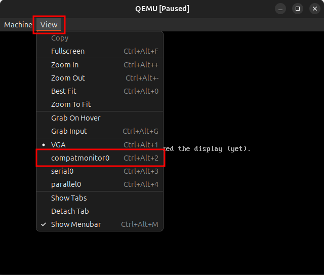
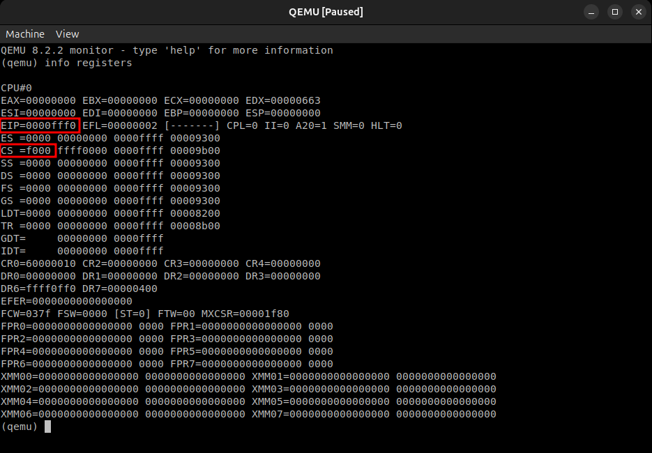
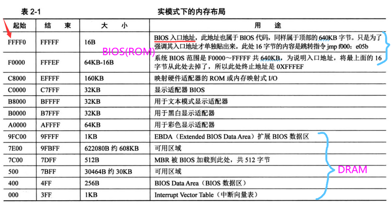
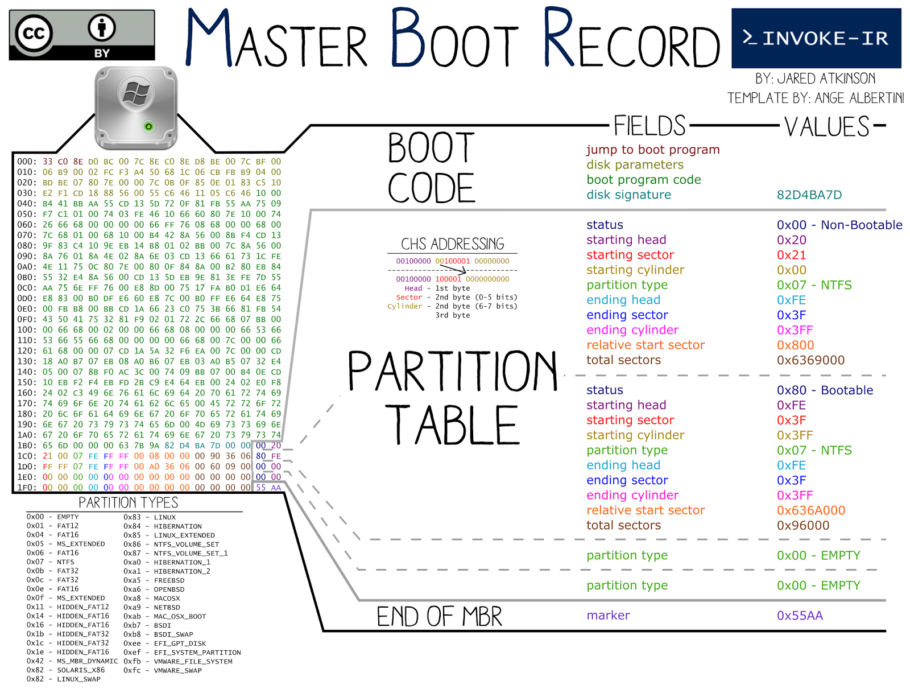

##### 此文章參考此書 [王者歸來 和大師一起動手撰寫一個完整的作業系統](https://www.eslite.com/product/1001239292597354?srsltid=AfmBOooSjhGaiBSI3jlV284pZnFE5xkf9pb9vt4BCLswAGfYRH2O_HIF) 與 [自制操作系统](https://blog.csdn.net/lyndon_li/category_12180087.html?spm=1001.2014.3001.5482) 系列文章

會以 x86 架構為主，並使用 C 語言與少量的組合語言來撰寫一個簡單的作業系統
使用 QEMU 作為模擬器，並使用 GCC 與 NASM 作為編譯器
使用 Linux 作為開發環境，並假設讀者對 Linux 有基本的了解
這系列文章的程式碼會放在 GitHub 上，讀者可以自行下載與修改

<!--more-->
---

##### 計算機的啟動過程


##### 第一條指令
當開機的瞬間，CPU 的代碼段寄存器 (Code Segment Register, CS) 會被設置為 `0xFFFF`，而指令指標寄存器 (Instruction Pointer Register, IP) 則會被設置為 `0x0000`。這表示 CPU 將從物理地址 `0xFFFF0` 開始執行指令。這個地址位於 BIOS ROM 的最後 16 個位元組，這段程式碼通常稱為「啟動程式碼」(Bootstrap Code)。
CS:IP 就是 PC 指標，也就是 CPU 下一個要執行的指令位址
我們可以用 qemu 的 `-S -s` 參數來讓 QEMU 在啟動時暫停，並開啟一個 GDB 伺服器，這樣我們就可以連接到 QEMU 並檢查 CPU 的狀態
```bash
sudo apt update
sudo apt install qemu-system-x86
qemu-system-i386 -S -s
```


輸入 `info registers` 就可以看到 CPU 通電時寄存器的狀態


<br>

##### BIOS 的工作
由於開機時處於實模式 (Real Mode)，段基址 (Segment Base Address) 要左移 4 位元 (乘以 16) 才能得到實際的物理地址
於是 `CS:IP = 0xFFFF:0x0000` 會被轉換成 `0xFFFF0`，這個地址位於 BIOS ROM 的最後 16 個位元組


不過，0xFFFF0 到地址最後的 0xFFFFF 只有 16 個字節的空間，BIOS 又要檢測硬體與各種初始化工作，還要建立中斷向量表 (Interrupt Vector Table, IVT)，顯然不夠用
這說明 BIOS 真正的啟動程式碼並不在這裡，這裡的程式碼只是用來轉跳到 BIOS 的其他部分
根據上表，BIOS 的啟動程式碼會將控制權轉交給位於 `0xF000:0xE05B` (物理地址 `0xFE05B`)
接下來會進行記憶體檢測、顯卡等硬體初始化，並在記憶體 `0x0000~0x03FF` 建立中斷向量表 (IVT) 並填寫中斷處理程式的地址
接著 BIOS 會檢查第一個可開機裝置的 0 盤 0 道 1 扇區 (Cylinder 0, Head 0, Sector 1) 最後的兩個位元組是否為 `0x55AA`，這是 MBR (Master Boot Record) 的標誌
如果有找到，BIOS 就會將這個扇區讀取到記憶體的 `0x7C00`，並將控制權轉交給這個位置

> 一直到這裡，我們都無法控制 CPU 的行為，因為這些都是由 BIOS 來完成的

如下圖，虛線左邊是 BIOS 的工作，右邊才是我們可以控制的部分


<br>

##### MBR 的結構
我們從 MBR 開始接手 CPU 的控制權，我們寫的第一個程式就是 MBR
MBR 的大小是 512 個位元組 (1 個扇區)，結構如下

圖片來源: [What's at 1st sector/MBR of hard disk(MBR Forensics)](https://nixhacker.com/explaining-the-magic-of-mbr-and-its/)

- 0~445 位元組: 引導程式碼 (Bootloader Code)
- 446~509 位元組: 分割表 (Partition Table)
- 510~511 位元組: 啟動標誌 (Boot Signature)，必須是 `0x55AA`，也就是上圖的 `END OF MBR`

我們的 MBR 程式碼必須放在前 446 個位元組，並且最後兩個位元組必須是 `0x55AA`，這樣 BIOS 才會認為這是一個有效的 MBR
分割表我們暫時不需要管它，可以全部設為 0

<br>

##### loader 的功能
由於 MBR 的空間只有 512 個字節，無法容納太多程式碼
所以我們的 MBR 程式碼只會做一件事，就是將第二個扇區 (Cylinder 0, Head 0, Sector 2) 的資料讀取到記憶體的 `0x7E00`，然後跳轉到這個位置執行
這個第二個扇區的程式碼我們稱為 loader，它的功能是
1. 初始化系統 (例如設定段寄存器)
2. 切換到保護模式 (Protected Mode)
3. 載入並執行作業系統核心 (Kernel)

<br>

##### kernel 的功能
loader 最終將 kernel 載入到記憶體的 `0x100000` (1MB) 處，並跳轉到這個位置執行

<br>

##### 總結
我們的作業系統將包含三個主要部分
1. MBR (512 bytes): 位於磁碟的第一個扇區
2. loader (512 bytes): 位於磁碟的第二個扇區
3. kernel (大小不定): 位於磁碟的第三個扇區

所以我們之後使用 NASM 來編寫 MBR 和 loader，使用 C 語言來編寫 kernel